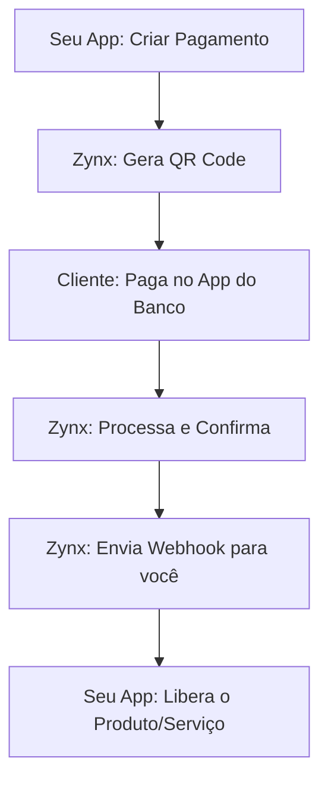

## Conceitos Fundamentais

Antes de começar a codar, é importante entender como a Zynx Wallet processa suas transações. Nossa API trabalha com o conceito de **Saldo em Centavos** para evitar erros de arredondamento matemático.

<CardGroup cols={2}>
  <Card title="Valores em Centavos" icon="coins">
    R$ 1,00 é representado como `100`. R$ 150,50 é `15050`.
  </Card>
  <Card title="Ambiente Único" icon="server">
    Utilizamos uma única URL base para todas as operações de produção.
  </Card>
</CardGroup>

## Fluxo de Integração PIX

O fluxo ideal para uma experiência de usuário fluida segue estes passos:



## 1. Obtenha sua Chave de API

Acesse o seu [Painel de Controle](https://painel.zynxwallet.com.br) e gere sua chave secreta.

<Note>
  Todas as chaves de API da Zynx começam com o prefixo `zynx_`. Nunca compartilhe sua chave secreta ou a exponha no frontend.
</Note>

## 2. Base URL

Todas as requisições devem ser feitas para a URL base abaixo:

```text
https://api.zynxwallet.com.br/api/v1
```

## 3. Autenticação

A autenticação é feita através do cabeçalho `X-API-Key` em todas as requisições.

```bash
X-API-Key: zynx_sua_chave_aqui
```

## 4. Sua Primeira Requisição

Tente criar um pagamento de teste usando o comando `curl` abaixo. Este comando gera um PIX de R$ 5,00.

```bash
curl --request POST \
  --url https://api.zynxwallet.com.br/api/v1/payment/create \
  --header 'Content-Type: application/json' \
  --header 'X-API-Key: zynx_sua_chave' \
  --data '{
  "value": 5.00,
  "description": "Meu primeiro pagamento",
  "coverFee": true
}'
```

## Próximos Passos

Agora que você já sabe como se autenticar, explore os recursos avançados:

<CardGroup cols={3}>
  <Card title="Pagamentos" icon="qrcode" href="/api-reference/pagamentos/criar" />
  <Card title="Saques" icon="money-bill-transfer" href="/api-reference/saques/criar" />
  <Card title="Webhooks" icon="webhook" href="/api-reference/webhooks" />
</CardGroup>
